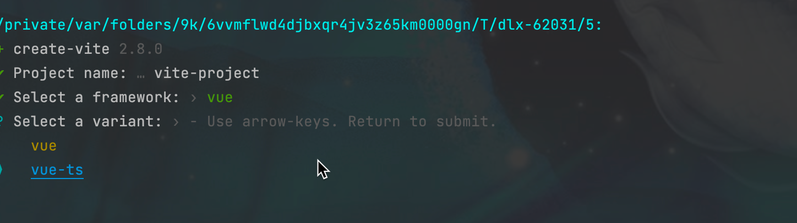

# Vue 3 + Typescript + Vite + Pinia + Quasar + pnpm

购物车示例


## Recommended IDE Setup

- [VSCode](https://code.visualstudio.com/)
    + [Volar](https://marketplace.visualstudio.com/items?itemName=johnsoncodehk.volar)

## 创建步骤

创建项目

```
 pnpm create vite 
```

输入项目名称


选择框架


选择vue-ts



项目创建完成


添加pinia

```
pnpm i pinia
```

修改 src/main.ts 文件


```
import {createApp} from 'vue'
import {createPinia} from "pinia";
import {Quasar, Notify} from 'quasar'
// Import icon libraries
import '@quasar/extras/material-icons/material-icons.css'

// Import Quasar css
import 'quasar/src/css/index.sass'
import App from './App.vue'

const app = createApp(App)
app.use(createPinia())
app.use(Quasar, {
    plugins: {Notify}, // import Quasar plugins and add here
})
app.mount('#app')

```

在src 文件夹下创建 store文件夹 并创建  appStore.ts文件

```
import {defineStore} from 'pinia'

export const useAppStore = defineStore('appStore', {
    state: () => {
        return {

        }
    }
})

```

在组件中使用 pinia

```
import {useAppStore} from "./store/appStore";

const appStore = useAppStore()
```

[添加QuasarUI框架](https://quasar.dev/start/vite-plugin)
